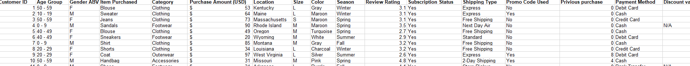
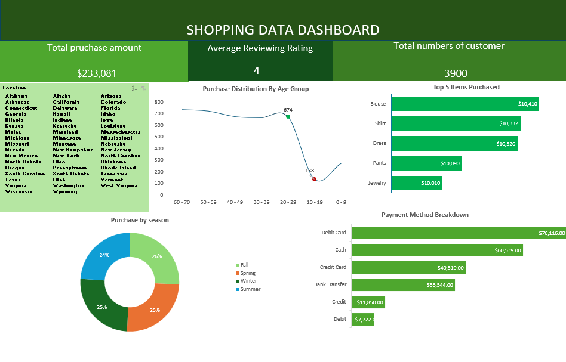

# Trendora Analysis Report

## Executive Summary
This dashboard provides a high-level overview of customer purchase behavior at Trendora, a growing fashion brand with both online and in-store customers. The analysis is based on the sample dataset provided and highlights key performance indicators alongside visual insights into customer spending patterns.

## Business Context
Trendora is a rapidly growing fashion brand that operates both online and through physical retail stores. As the company expands, management needs a clear view of customer behavior and business performance to guide strategic decisions

## Objectives
The main objectives of this dashboard are to:
- Track Key Performance Indicators and provide a quick snapshot of total purchase amount, average review rating, and total unique customers.
- Highlight the five most frequently purchased items to guide inventory and promotions.
- Analyze purchase distribution by age group to uncover core customer segments.

## Data Overview
The dataset consists of 3,900 purchase records with 16 columns, covering customer details (age, gender, location), purchase information (items, quantity, amount, season, date), transaction details (payment method, store type), and feedback metrics (review ratings, return status).

## Data Preview

## Key Findings
- Total purchase amount is approximately $233,000
- The analysis reveals that the top five purchased items are blouses, shirts, dresses, pants, and jewelry, respectively.
- The analysis indicates that customers spend the most during the Fall season.
- Customers in the 60–70 age group account for the highest number of purchases.

## Dashboard
 

## Data Cleaning and Transformation
- Handling Missing Values : Checked for and addressed blank or null entries in key columns such as purchase amount, age, and review rating.
- Removing Duplicates : Eliminated duplicate customer or transaction records to avoid double counting.
- Standardizing Data Formats : Converted dates into a consistent format, standardized categorical fields 

## Detailed Findings & Analysis
 ### Key Performance Indicators 
- Total purchase amount is $233,000 during the review period.
- Average  Ratings is 4.
- The total number of customers is 3900.

 ## Sales Distribution by Product Category
  - Blouses consistently outsold all other categories, generating total sales of $10,410, followed by shirts at $10,332.
  - Dresses, pants, and jewelry contributed significantly to total sales, with revenues of $10,320, $10,090, and $10,010, respectively. 

 ## Payment Method Breakdown
 - The analysis shows that customers prefer paying with debit cards, followed by cash, while credit cards are the least used payment method.
 
 ## Purchase Distribution by Age Group
 - The analysis indicates that the majority of sales come from the 60–70   age group, with a total of 739 items purchased, and this trend remains consistent across all           locations.
 - Their dominance has been stable over the four-year period, making them a loyal and reliable customer base for Trendora.
  
## Purchase Amount by Season
 - The analysis shows that sales are evenly distributed across all seasons, with Fall, Spring, and Winter each accounting for 25% and Summer close behind at 24%.
 - This seasonal pattern has remained consistent all through, with no single season showing significant dominance in sales.
 
  ## Recommendations
- Trendora should focus on the 60–70 age group, as this segment drives the highest purchases and revenue. Strengthening loyalty initiatives such as targeted    promotions,membership perks, and personalized product recommendations will help retain and grow this valuable customer base

- Trendora should optimize its popular product categories blouses, shirts, dresses, pants, and jewelry by ensuring consistent stock availability, introducing variety, and promoting these items to further boost sales.

- Trendora can leverage seasonal stability, as sales are evenly distributed across all seasons, by maintaining steady marketing and inventory planning year-round rather than concentrating efforts on a single season.

## Tools Used
 **Microsoft Excel :** Data cleaning, transformation, pivot tables, and dashboard creation

## Conclusion

Trendora has demonstrated consistent sales performance across all seasons, with strong contributions from blouses, shirts, and dresses, and balanced customer preferences across payment methods. While the 60–70 age group remains the leading customer segment, opportunities exist to drive growth among younger demographics. Leveraging these areas will position Trendora for sustained success in the years ahead.

